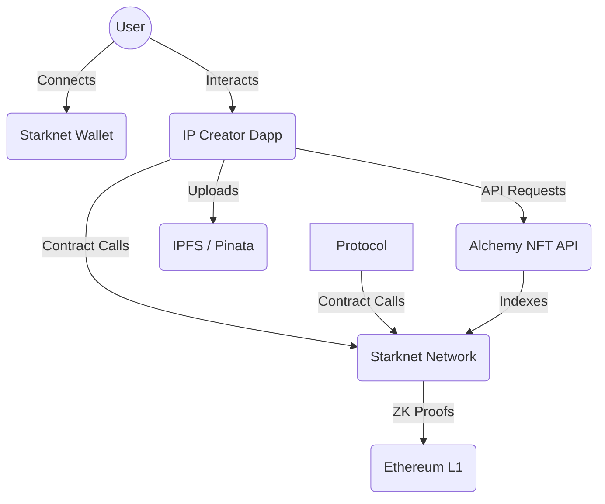

> [!IMPORTANT]
> Mediolano dapp is in constant development. Use for testing purposes only. 

Quick links:
- [IP Creator Dapp](https://ip.mediolano.app)
- [Website](https://mediolano.xyz)
- [Telegram Group](https://t.me/integrityweb)
- [X / Twitter](https://x.com/mediolanoapp)


## Programmable IP for the Integrity Web

Mediolano provides seamless tokenization services for intellectual property, leveraging Starknet’s unparalleled high-speed, low-cost, and smart contract intelligence for digital assets to empower creators, collectors, and organizations to protect and monetize their IP assets effectively.

Registering intellectual property on Mediolano means your asset is automatically tokenized and protected in 181 countries, according to The Berne Convention for the Protection of Literary and Artistic Works, adopted in 1886. Mediolano assets generate Proof of Ownership to guarantee recognition of the authorship of IP without the need for registration with the World Intellectual Property Organization (WIPO).

Mediolano offers permissionless services with ZERO FEES for Programmable IP, such as artwork, videos, music, literary works, AI models, software, and other works of authorship. The copyright is immutable time stamped on Starknet public blockchain, and settled on Ethereum, providing Proof of Ownership valid for 50-70 years, in accord with the legal jurisdiction. Tokenizing intellectual property with smart contracts opens the door to countless opportunities, from integrations with communities and games to monetization with AI Agents.

Mediolano aims to serve as the intellectual property provider for the integrity web, a public good to empower programmable IP to anyone. By integrating standards, innovative technology and decentralization, Mediolano ensures interoperability, security and sovereignty. Our platform is tailored for the tokenization and management of intellectual property. Feel free to reach out!


### Key Features

- **Programmable IP**: Transform creative works (images, music, videos, AI models, research papers) into programmable digital assets that can be managed, tracked, and monetized.

- **Remix & Derivatives**: Enable creative remixing of intellectual property while maintaining clear lineage and attribution through smart contracts.

- **Proof of Ownership**: Generate blockchain-verified certificates of authorship and ownership, providing a cryptographically secure claim to your IP.

- **Provenance & Lineage**: Access an immutable history of every asset, tracking its creation, ownership changes, and derivative relationships with full transparency.

- **Asset Transfer**: Securely transfer ownership of IP assets peer-to-peer on the Starknet network with instant finality.

- **High-Speed & Low-Cost**: Leverage Starknet's ZK-rollup technology for unparalleled speed and negligible fees.

- **Gas Fee Abstraction**: Integrated AVNU Paymaster to provide a seamless user experience by abstracting gas costs. (Experimental)

## IP Creator Dapp Architecture

The IP Creator Dapp is built as permissionless, decentralized application leveraging the full power of Starknet and web3 to provide a seamless user experience.

### Technical Stack

- **Frontend Framework**: [Next.js 15](https://nextjs.org/) (App Router) & [React 19](https://react.dev/)
- **Styling**: [Tailwind CSS](https://tailwindcss.com/) & [Shadcn UI](https://ui.shadcn.com/)
- **Blockchain**: [Starknet](https://starknet.io/) (L2 Rollup on Ethereum)
- **Smart Contract Interaction**: Mediolano Protocol Contracts, [Starknetkit](https://www.starknetkit.com/) & [Starknet.js](https://www.starknetjs.com/)
- **Decentralized Storage**: [IPFS](https://ipfs.tech/) via [Pinata](https://www.pinata.cloud/)
- **Data Indexing**: [Alchemy NFT API](https://www.alchemy.com/nft-api) & Starknet Events

### Architecture Diagram




## Roadmap

- [x] Starknet Ignition **24.9**
- [x] MIP Protocol @ Starknet Sepolia **24.11**
- [x] Mediolano Dapp @ Starknet Sepolia **24.11**
- [x] Programmable IP Contracts **25.02**
- [x] MIP Dapp @ Starknet Sepolia **25.06**
- [X] MIP Protocol @ Starknet Mainnet **25.07**
- [X] MIP Collections Protocol @ Starknet Sepolia **25.07**
- [X] MIP Dapp @ Starknet Mainnet **25.08**
- [X] MIP Collections Protocol @ Starknet Mainnet **25.08**
- [X] MIP Mobile @ Android Google Play **25.09**
- [X] MIP Mobile @ iPhone iOS App Store **25.12**
- [X] Mediolano Collections Protocol @ Starknet Mainnet **25.12**
- [ ] Mediolano Dapp @ Starknet Mainnet **26.01**


## Get involved

Contributions are **greatly appreciated**. If you have a feature or suggestion that would make our platform better, please fork the repo and create a pull request with the tag "enhancement".

1. Fork the Project
2. Create your Feature Branch (`git checkout -b feature/Feature`)
3. Commit your Changes (`git commit -m 'Add some Feature'`)
4. Push to the Branch (`git push origin feature/YourFeature`)
5. Open a Pull Request

## Getting Started


### Running locally

Dapp requirements:
- Next.js 15
- React 19
- Node.js 18.18 or later.
- macOS, Windows (including WSL), and Linux are supported.

Clone the repository to your local machine:

```bash
git clone https://github.com/mediolano-app/mediolano-app.git
```
Install dependencies for Next.js 15 + React 19:

```bash
npm install --force
```

Run the development server:

```bash
npm run dev
```

Open [http://localhost:3000](http://localhost:3000) with your browser to see the result.


### Running via Docker

To run the containerized application, there is no dependencies requirement. 
Clone the repository, and run:

```bash
 docker build -t mediolano-app .     
```

To build the image. Then, start the container:

```bash
docker run -p 8080:8080 mediolano-app
```

### Quick Start with Paymaster

```bash
# 1. Clone and install
git clone https://github.com/mediolano-app/mediolano-app.git
cd mediolano-app
npm install

# 2. Configure environment
cp .env.example .env.local
# Add your AVNU Paymaster API key

# 3. Run the app
npm run dev

# 4. Visit /paymaster-demo to try it out!
```
